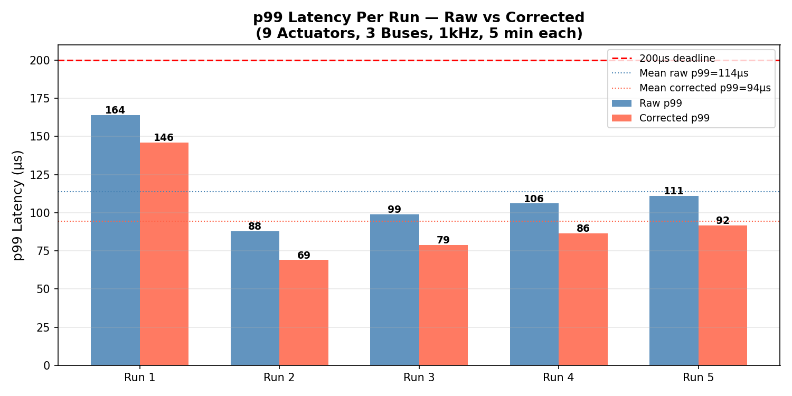
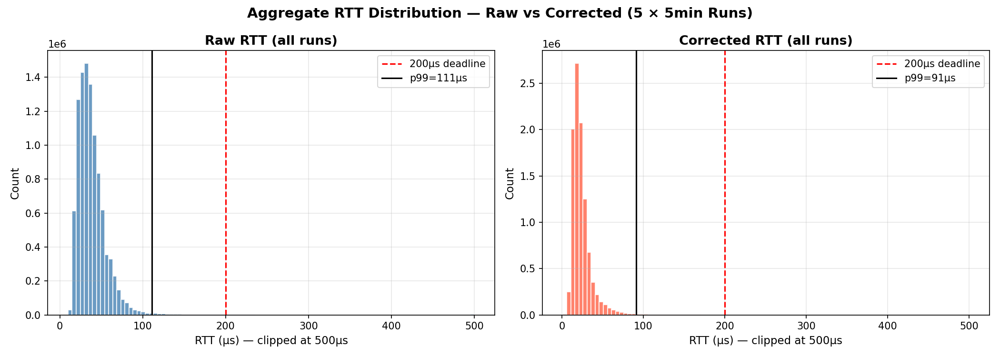
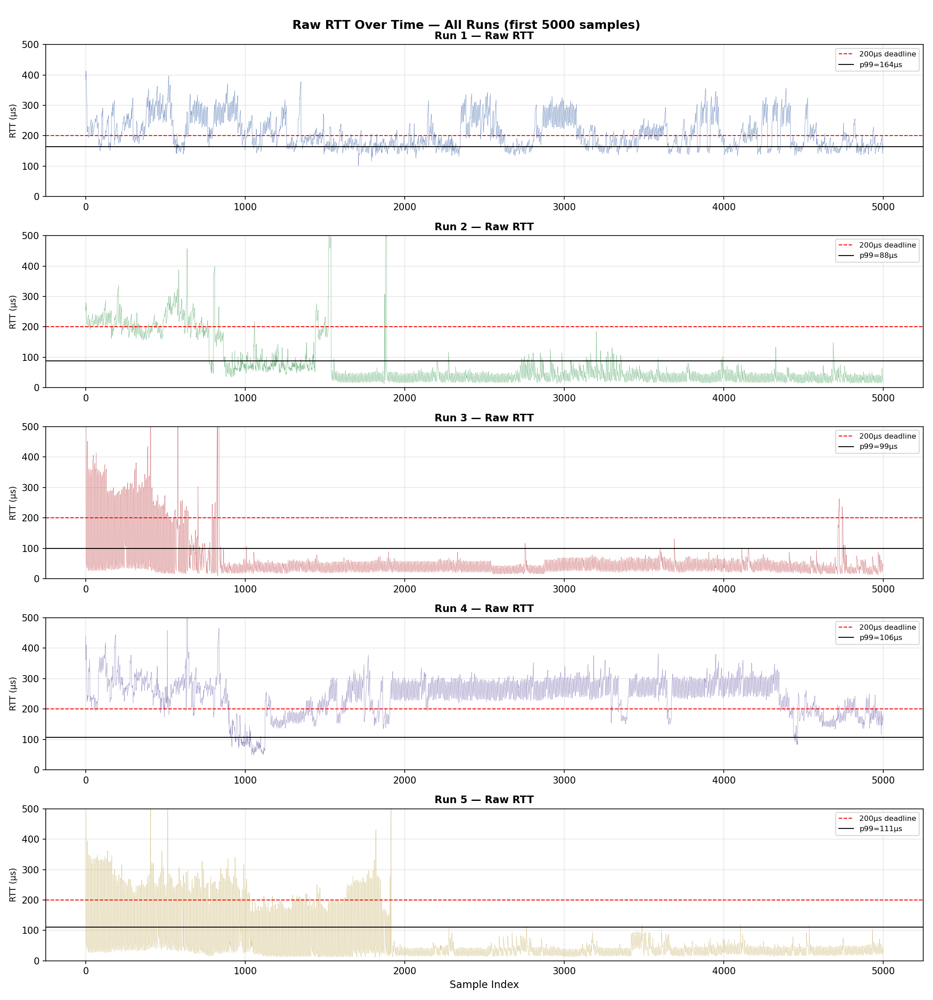
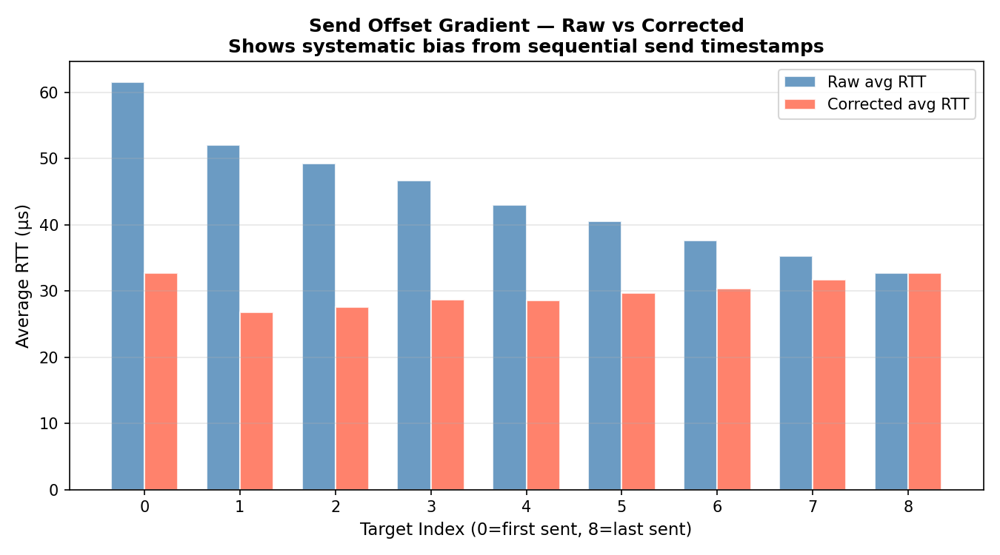
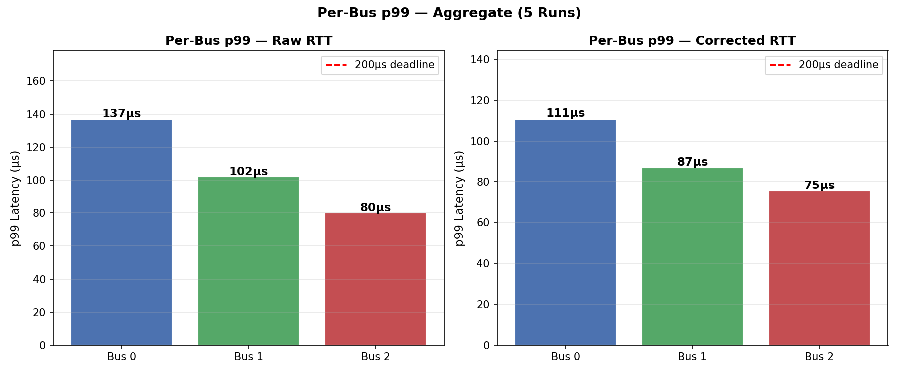

# Robot Actuator Loop Design Report

## 1. Overview
This report covers the design, implementation, and performance analysis of a single-threaded UDP-based actuator control loop. The objective is to maintain a p99 round-trip latency under 200µs using a single thread while the robot orchestrator is sending commands and performing disk writes. See README.md for build instructions and full architecture details.

## 2. Hardware & OS Environment
- Hardware: MacBook Pro, Apple M1 Pro chip, 16GB RAM
- OS: macOS 26.1 (Build 25B78)
- Compiler: Apple clang version 17.0.0 (target arm64-apple-darwin25.1.0)
- Build flags: -Wall -O2 -lm
- Background load: normal desktop usage during all benchmark runs (VS Code open). Not an isolated or dedicated benchmarking environment.

## 3. Timing Methodology & Results
### Measuring RTT (Round Trip Time)
RTT is defined as the time from when the orchestrator stamps `send_times[i] = now_ns()` to when it reads the response via `recvfrom()` and calls `now_ns()` again. `mach_absolute_time()`, via `now_ns()`, in `message.h` is used for nanosecond-precision monotonic timestamps on Mac (more accurate than `clock_gettime()`). Each of the 9 actuators has its own UDP port, to avoid ambiguity about which response belongs to which command. A non-blocking poll loop collects all 9 responses. 

### Non-Blocking Sockets Setup
`fcntl(socks[i], F_SETFL, O_NONBLOCK)` sets the O_NONBLOCK flag on each socket immediately after creation. This is relevant because `recvfrom()` normally blocks until data arrives. With `O_NONBLOCK` set, `recvfrom()` instead returns immediately every time, which prevents the RTT from including time waiting for a response that isn't received immediately.

### Benchmark Setup
- 5 independent runs were executed, each lasting 5 minutes. 
- Total measurements: 10,166,040 across all 5 runs
- For each measurement, the following was recorded: counter, bus, target_id, target_idx, rtt_us

**Output**

| Column        | Meaning |
|---------------|---------|
| `counter`     | Tick number (increments by 1 every 1ms). e.g. counter=1000 is the first slow-tick log write. |
| `bus`         | Which of the 3 buses this actuator belongs to (0, 1, or 2). Determined by port = `PORT_BASE + bus*3 + actuator_id`. |
| `target_id`   | The actuator's ID on its bus (0, 1, or 2). Combined with `bus`, uniquely identifies one of the 9 actuators. |
| `target_idx`  | Position in the send order for that tick (0-8). 0 = first command sent, 8 = last. Used for the send-offset correction. |
| `rtt_us`      | Measured round-trip time in microseconds for this actuator's command-response pair on this tick. |

**Example:** `counter=1500, bus=1, target_id=2, target_idx=5, rtt_us=42` means on tick 1500, actuator 2 on bus 1 (the 6th command sent that tick) had a 42µs round-trip time.

#### Send-Offset Correction
Due to the send order, `target_idx=0`'s timestamp is recorded first, and `target_idx=8`'s timestamp is recorded last. This creates a gradient in the raw RTT. The reason is that when responses arrive for the indices recorded earlier, the orchestrator is still in the send loop sending later commands, so the earlier indices' RTTs include this extra time (target_idx=0 has the largest inflation). 

Hence, we correct this using the following correction formula: `overhead_per_send = (avg_rtt_idx0 - avg_rtt_idx8) / 8`
`corrected_rtt = raw_rtt - ((8 - target_idx) * overhead_per_send)`
Essentially we are finding the average overhead per index and subtracting it from that index. This gradient is shown in `images/gradient_raw_vs_corrected.png`.

### Results
#### p99 Summary Table
| Run | Raw p99 | Corrected p99 |
|-----|---------|---------------|
| Run 1 | 164.0µs | 146.0µs |
| Run 2 | 88.0µs | 69.0µs |
| Run 3 | 99.0µs | 79.0µs |
| Run 4 | 106.0µs | 86.4µs |
| Run 5 | 111.0µs | 91.8µs |
| **Mean** | **113.6µs** | **94.4µs** |
| Std Dev | 26.4µs | 26.9µs |

#### Aggregate Distribution Table
| Metric | Raw RTT | Corrected RTT |
|--------|---------|---------------|
| Min | 10.0µs | 1.0µs |
| Median | 35.0µs | 21.0µs |
| Mean | 44.3µs | 29.9µs |
| p95 | 70.0µs | 49.2µs |
| **p99** | **111.0µs** | **91.2µs** |
| p99.9 | 312.0µs | 297.8µs |
| Max | 389,893µs | 389,892µs |











## 4. Single-Thread Design / Slow Tick Handling
Both the sending and receiving of commands between the orchestrator and actuators, and the disk write performed by the orchestrator, are handled by a single thread. First, the orchestrator sends commands to each of the 9 targets in a send loop. Then, the orchestrator listens for responses in a receive loop.

To handle the slow tick on a single thread, the log write occurs after counter++. This ensures the RTT measurements for the current tick are already complete, so additional time spent in write_log() is not included in that tick's RTT.

Initially, we implemented a blocking sequential receive, which blocks while waiting for each response in bus order (bus 0, bus 1, bus 2), each with a timeout. The problem with this approach is that if bus 0 takes time to respond, buses 1 and 2 wait even longer, inflating their RTTs by adding time spent waiting. In this version, p99 was 265µs, exceeding the 200µs deadline. 
```c
// receive feedback from each bus — BLOCKING, sequential
for (int bus = 0; bus < NUM_BUSES; bus++) {
    struct sockaddr_in from;
    socklen_t from_len = sizeof(from);

    // blocks until response arrives or 5ms timeout
    ssize_t n = recvfrom(socks[bus], &response, sizeof(response), 0,
                         (struct sockaddr *)&from, &from_len);

    if (n == sizeof(Message)) {
        uint64_t now = now_ns();
        uint64_t rtt = now - send_times[bus];
        log_rtt(counter, bus, rtt / 1000);
        // log buffer storage
    }
}
```

## 5. Which Changes Produced the Largest Improvements
As discussed above, the single change that produced the largest improvement was switching from blocking to non-blocking sockets in the receive loop. This dropped p99 from 265µs to ~94-114µs. This is likely because non-blocking sockets prevent the orchestrator from sitting idle waiting on one socket while other sockets have already received a response.

## 6. What Didn't Help / Made Things Worse
Several small changes were made initially, which did not produce any improvements (baseline RTT increased from 60-92µs to 115-181µs):
- Changed `clock_gettime(CLOCK_MONOTONIC)` → `mach_absolute_time()` (more precise clock on Mac)
- Changed `usleep()` → `nanosleep()` (sleep precision using nanoseconds)
This suggests that on macOS, clock and sleep precision are not the bottleneck; OS scheduling has a much greater effect on performance. 

## 7. Follow-Up Results Discussion
### Graphs

Above is the histogram of all latencies across all 5 runs, with raw data on the left and corrected data on the right. Both histograms show that most measurements cluster tightly around 10-50µs, suggesting that this is the "normal" speed. A few measurements stretch out into the hundreds/thousands, due to rare events (e.g., OS scheduling anomalies, background tasks). Both histograms are right-skewed, with the tail showing these few measurements stretching into the hundreds/thousands. While both distributions cluster around roughly the same values, the corrected distribution is tighter, which is expected since the correction removes the added time in RTTs caused by the orchestrator still being in the send loop when responses arrive. 


Above is the raw RTT as a function of time for the first 5000 samples of each of the five runs. Run 1 shows tight oscillations around 200µs throughout all 5000 samples. Runs 2 and 3 show tight oscillations around 200µs only for the first 1000 samples, after which the oscillations cluster around 100µs. Run 4 shows oscillations around 300µs, a dip where oscillations cluster around 100µs, then tight oscillations around 300µs again, followed by a period of oscillations around 200µs from sample 4500 to 5000. Run 5 shows tight oscillations around 200µs until sample 2000, after which the oscillations cluster between 0 and 50µs for the rest of the first 5000 samples.

A potential explanation for the higher RTTs observed before dropping to a lower baseline (in Runs 2-5) is that the orchestrator's memory pages were not yet fully cached at the start. Once the pages are cached, access time for the necessary data/processes decreases, resulting in the lower baseline RTT.

While Runs 2, 3, and 5 all show the expected pattern of a "warm-up" period (e.g., page faults/memory mapping, cache warming, branch predictor warming) followed by a drop to a faster baseline RTT, Run 4 shows the most "unstable" pattern, suggesting more interference from background programs. 

Run 1's tight oscillations around 200µs across all 5000 samples, rather than eventually dropping to a lower baseline as in Runs 2-5, could be due to a background process causing interference throughout the run, consistent with the 390ms spike later in this run (Run 1's outlier max value). 


Above is the p99 latency per run (raw and corrected). Run 1 has the worst p99 at 164µs and the worst max at 390ms, which is consistent with Run 1 never dropping to a lower baseline RTT, suggesting something was different about the OS scheduling and background processes during this run. This could also be related to warm-up effects, since this run was conducted right after the computer woke from sleep.


Above is the per-bus p99 latency, for both raw and corrected RTTs. Both show that bus 0 is always highest, even after correction, though the gradient is smaller in the corrected version. This is expected: while the correction attempts to remove time spent in the send loop from the recorded RTT, the correction may not be perfectly linear. Additionally, the correction is based on averages (overhead_per_send = (avg_rtt_idx0 - avg_rtt_idx8) / 8), while p99 reflects tail behavior.


Above is the average RTT across all targets (send order 0-8). The raw average RTTs show a high-to-low gradient, with target 0 highest. This is consistent with target 0's RTT including the most additional time, since its command is sent first and its response arrives while the orchestrator is still sending subsequent commands. The corrected average RTTs show that target 0 and target 8 have roughly the same value. This makes sense because target 8 receives no correction (the correction assumes we begin reading responses immediately after target 8 is sent, since the send loop is finished at that point); target 8 therefore serves as the baseline, and it follows that corrected target 0 should match this baseline as well. However, an unexpected slight increasing gradient appears from targets 1 through 8. This is likely because the receive loop itself has slight overhead, since target 0 is read first, then target 1, and so on.

Notably, even though the receive loop's overhead could produce the gradient observed in targets 1-8, this is not reflected in the per-bus p99 latency. In fact, the opposite is true (targets 0-2 are on bus 0, so bus 0 is polled first, yet bus 0 has the highest p99 latency). This may be because the gradient across targets 1-8 is relatively slight, while target 0 still has the highest average RTT overall, which is reflected in bus 0's higher p99. 

### Additional Discussion
The single-threaded design holds up because the orchestrator finishes collecting all 9 responses for the current tick first, and only then handles the log write if it is a slow tick (counter is a multiple of 1000). The RTTs for the current tick are therefore already recorded before the log write occurs.

Overall, the most significant change was switching from the blocking to the non-blocking poll loop, which prevented the program from blocking while waiting for a response (instead, the orchestrator rapidly loops, repeatedly checking all 9 sockets). As a result, p99 improved from 265µs to 113.6µs raw / 94.4µs corrected.

## 8. What I'd Do With More Time
### Eliminating Receive Loop Overhead When Recording RTT
While we use non-blocking sockets that rapidly loop over all 9 targets and constantly check each for a response, we still have overhead as we iterate over each of the 9 targets, which adds to the RTT for each target. 

One potential solution would be to randomize poll order each iteration, so instead of checking 0 through 8, we'd randomly shuffle the order every iteration.

Another potential solution is to use the timestamp at which the packet arrived, rather than the moment we read it. This would give a more accurate time measurement by eliminating the additional time introduced by loop overhead.

In retrospect, this could have been done using SO_TIMESTAMP, which would have added complexity to the code (macOS and Linux handle this differently, requiring additional branching). Additionally, even with RTT calculated using the read time, we still achieved a p99 latency under 200µs. Given additional time, I'd use SO_TIMESTAMP to record the response arrival time, yielding more accurate RTT measurements and removing the contribution of receive loop overhead to RTT.

### Additional Extensions
- Test on a Linux system and compare p99 latencies
- Monitor background processes (e.g., Activity Monitor) to see how different background processes, or combinations of them, affect performance
- Test under higher load to find the "breaking point": the tick rate is currently 1kHz, so we could incrementally increase it to see at what point p99 exceeds 200µs